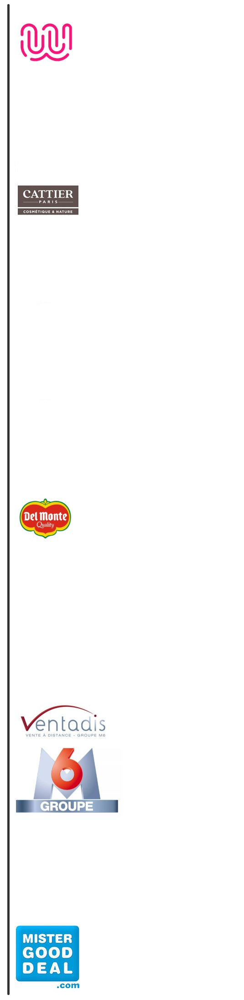

<link rel="stylesheet" href="{{ '/assets/css/styles.css' | relative_url }}">

 
 

## **Hard Skills**

  

    
 
Python

      

        

      

      

        Numpy, Pandas, Seaborn, NLP, Machine Learning
      

    

  

  

    
SQL

    

      

    

    

      Administration, Manipulation et Analyse de Bases de Données
    

  

  

     
ETL

     

       

     

    

       MageAI, Knime, DBT
    

  

  

     
Data Visualization

     

       

     

     

       Power BI, QlikSense, TM1, Tableau, Cegid, Dynamcis
     

   

   

      
Excel

      

        

      

      

        Maîtrise des fonctions et formules liées à la synthèse et restitution de données, et création de macros
      

    

 
 

## **Soft Skills**

  

    
 
Sens de l'écoute et de la communication

      

        

      

      

        
      

    

  

  

    
Esprit de synthèse et d'analyse

    

      

    

    

        
      

    

  

     
Curiosité et goût pour l'optimisation

     

       

     

    

        
      

  

  

     
Pédagogie

     

       

     

    

        
      

   

   

      
Gestion de Projets

      

        

      

     

        
      

   

  

       
Rigueur

       

         

       

    

        
      

   

 
 

## **Parcours Professionnel**

  

    
  

  

      <h2>Data Analyst</h2> 
      <strong>De septembre 2024 à février 2025</strong> Wild Code School Paris
      <em>Formation en BootCamp</em>
      <ul>
      <li>Dataviz (Power BI, Tableau)</li>
      <li>Manipulation & Analyse de données (Python, SQL)</li>
      <li>Machine Learning & NLP</li>
      <li>ETL, Plateformes collaboratives, API, Webscrapping & Apps (Streamlit)</li>
      </ul>
      <h2>Directrice Administrative et Financière</h2> 
      <strong>De mai 2021 à mars 2024</strong> Pierre Cattier Bondoufle
      <ul>
      <li>Chef de projet & Admin sur la mise en place d'un nouvel ERP pour améliorer
      la gestion des données financières (Qlik)</li>
      <li>Construction & Analyse des KPI's</li>
      <li>Management des départements Comptabilité, Contrôle de Gestion & ADV (10
      p.)</li>
      </ul>
      <h2>Responsable du Contrôle de Gestion</h2> 
      <strong>De mars 2017 à mai 2021</strong> Pierre Cattier Bondoufle
      <ul>
      <li>Mise en place d'un processus de suivi budgétaire mensuel</li>
      <li>Formation des équipes internes à l'utilisation de l'outil décisionnel pour une
      meilleure autonomie dans l'analyse des données</li>
      </ul>
      <h2>Financial Analyst</h2> 
      <strong>De février 2015 à février 2017</strong> Fresh Del Monte Rungis
      <ul>
      <li>Mise en place du contrôle de gestion opérationnel de l'entité France du
      groupe et du processus budgétaire</li>
      <li>Analyse des écarts entre les prévisions et les résultats réels pour identifier les
      opportunités d'amélioration</li>
      <li>Collaboration avec les équipes opérationnelles pour la mise en place de
      prédictions</li>
      <li>Analyse des coûts de revient des produits pour optimiser la rentabilité</li>
      </ul>
      <h2>Contrôleur de Gestion</h2> 
      <strong>De juin 2006 à février 2015</strong> Ventadis-Groupe M6 Rungis
      <ul>
      <li>Construction et mise en place du contrôle de gestion sur les BU (e-commerce
      & Industrie) - Reportings, Forecasts et Processus Budgétaire</li>
      <li>Construction et Analyse des KPI's périodiques (Business, Coût de Production,
      suivi et analyse des moyens Marketing)</li>
      </ul>
      <strong>Management</strong>
      <ul>
      <li>Mise en place d'un outil de suivi des coûts de production dans un objectif de
      maîtrise des coûts</li>
      </ul>
      <h2>Analyste Fonctionnel</h2>
      <strong>De décembre 2004 à juin 2006</strong> Mister Good Deal Chilly Mazarin
      <ul>
      <li>Optimisation et mise en place d'outils pour le département financier</li>
      </ul>
  

 
 

## **Formation**

  

    
  

  

      <strong>Evry Val D'Essonne</strong>
      <ul>
      <li>Maîtrise en Administration et Gestion des Entreprises <em>De septembre 2002 à juin 2004</em></li>
      <li>DEUG Economie & Gestion <em>De septembre 2001 à juin 2002</em></li>
      <li>DEUG de Mathématiques et Informatiques Appliquées aux Sciences <em>De septembre 1999 à juin 2001</em></li>
      </ul>
      <strong>Lycée JP Timbaud</strong>
      <ul>
      <li>BACCALAUREAT - Scientique <em>juin 1999</em></li>
      </ul>
